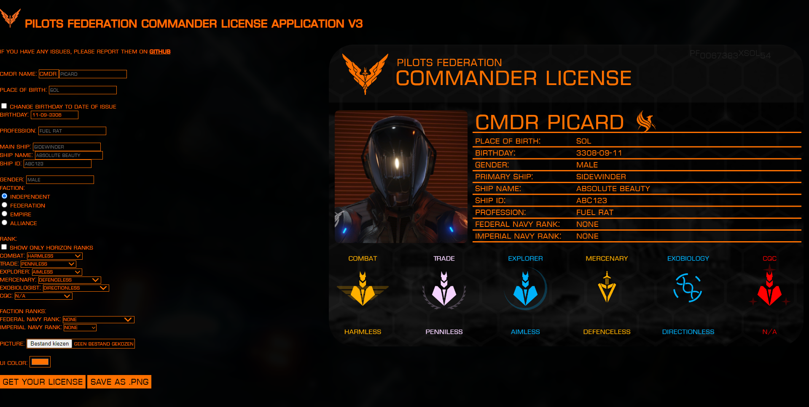

# CMDR License V3

A commander license generator for the game Elite: Dangerous



## Development setup

```sh
npm install -g electron
npm install
```

## App build instructions

```sh
npm run dist
```

## Release History

- 2.0.0
  - ADD: Bunch of features compared to V1
- 2.1.0
  - ADD: Standalone app using electron
- 3.0.0
  - ADD: Odyssey ranks and prestige ranks
  - ADD: Odyssey and Horizon mode
  - ADD: Document number
  - CHANGE: Combined N/A and minimum rank mode. CQC defaults to N/A.

## Meta

Distributed under the ISC license. See [LICENSE](LICENSE) for more information.
